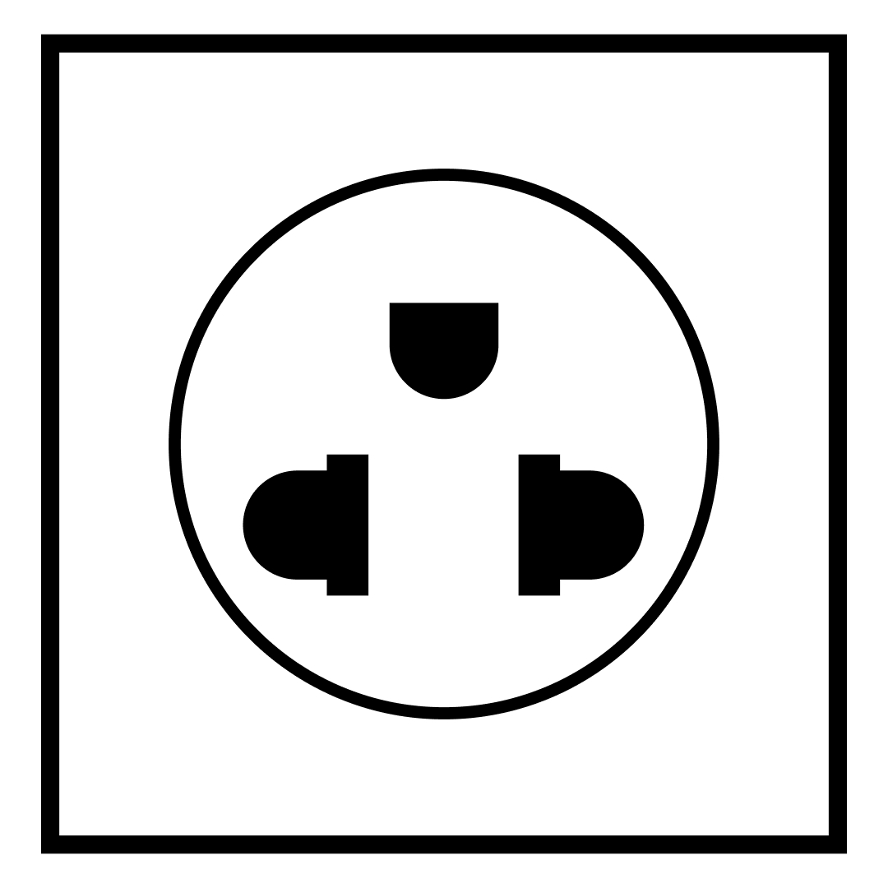
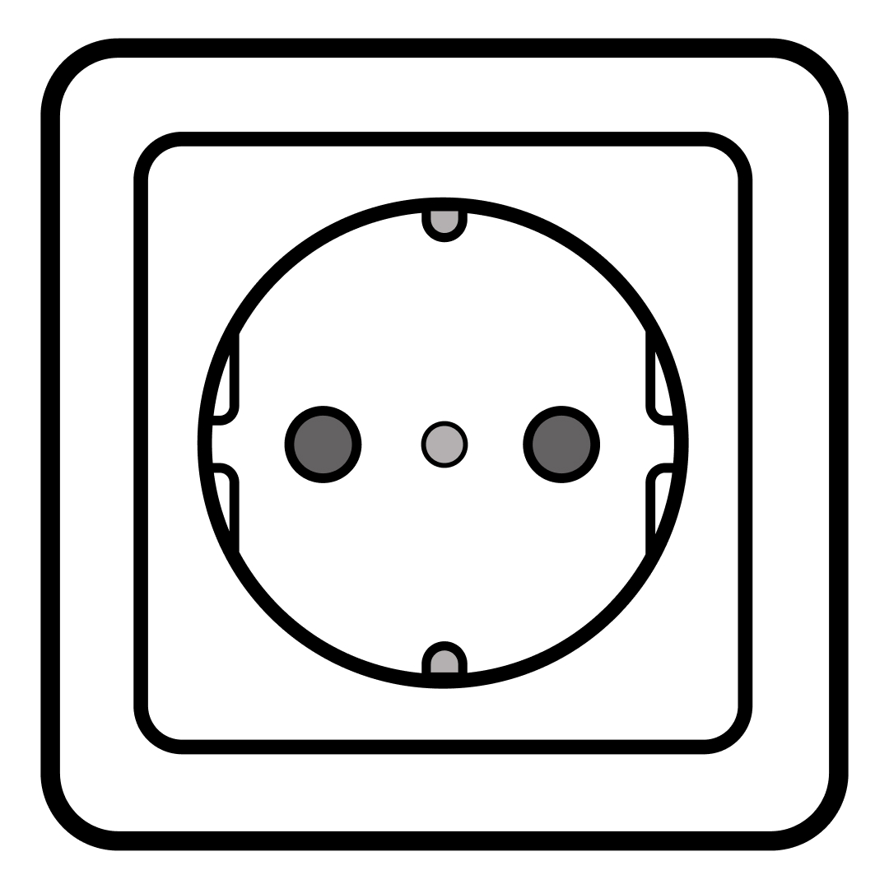
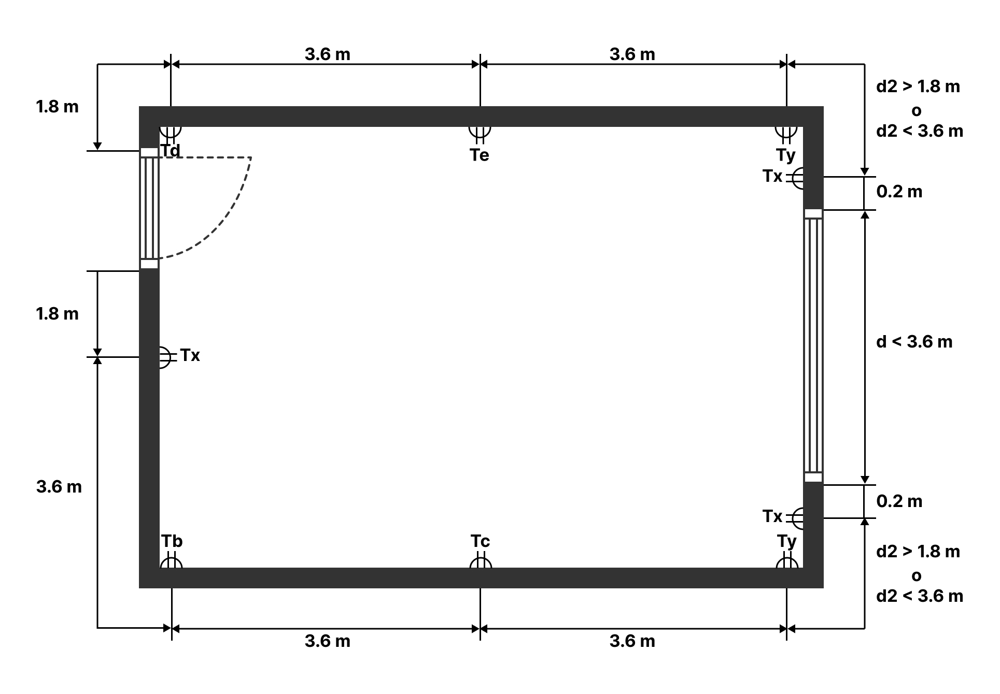
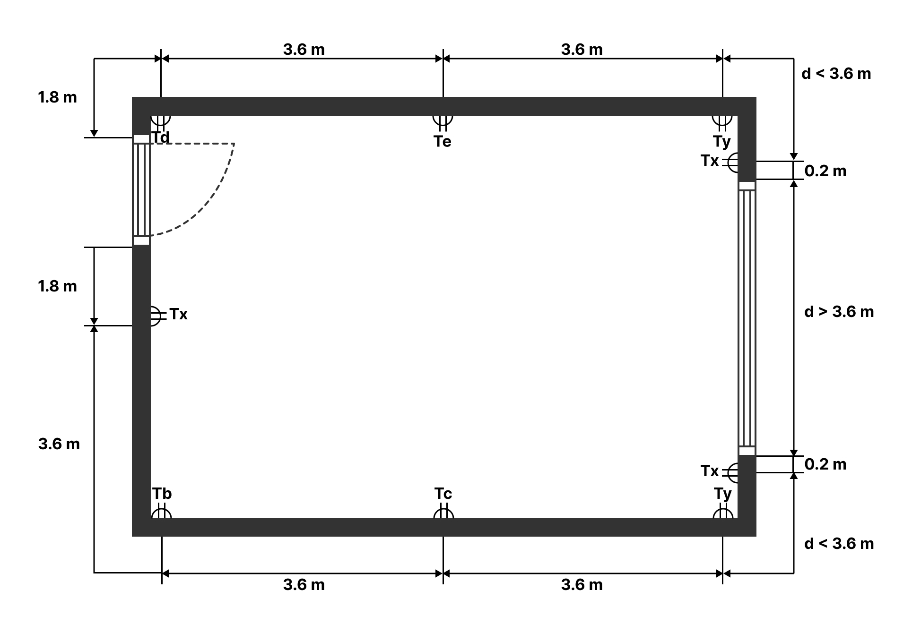
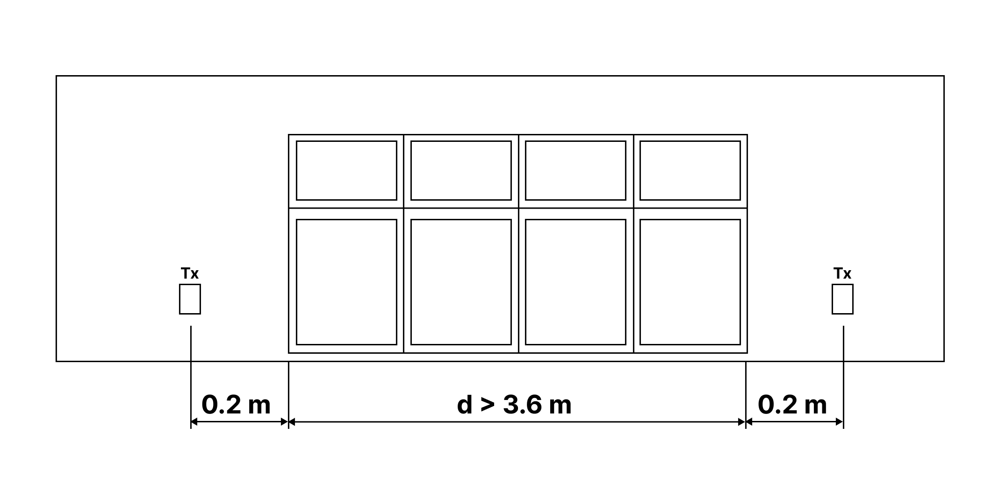
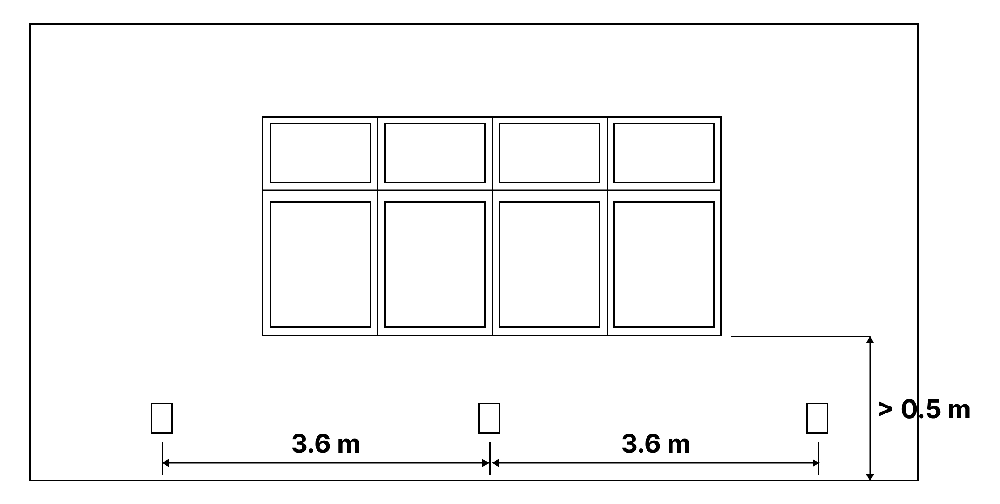

6 CIRCUITOS DERIVADOS

6.1 Características del suministro eléctrico
Los requisitos y disposiciones del presente capítulo se aplican a partir de los bomes de entrada del primer dispositivo de maniobra y protección posterior a la medición (el dispositivo ubicado en el tablero de medición después del medidor de energía eléctrica), incluyendo los tableros de distribución y los circuitos derivados.

6.2  Alimentadores de tableros de distribución
Los alimentadores de los tableros principales de distribución, tableros secundarios y relativos deben cumplir con los requisitos establecidos en el capítulo 9 de esta norma.

6.3 Instalaciones existentes, modificaciones y ampliaciones
Toda intervención en una instalación eléctrica existente se debe realizar conforme a las prescripciones de la familia de normas NB 777.

En el caso de ampliación en un inmueble existente, la instalación eléctrica de dicha ampliación debe cumplir con lo establecido en la presente norma, considerando las partes o capítulos que correspondan aplicar. Es responsabilidad del instalador o encargado de las obras eléctricas entregar al propietario información precisa y veraz referida al estado de las instalaciones eléctricas existentes, detallando especialmente las condiciones de seguridad de la misma.

<!-- página 1 -->

Solamente personas calificadas por su experiencia y conocimientos técnicos, estarán autorizadas a instalar, regular, examinar o realizar las obras eléctricas necesarias o requeridas.

6.4 Suministro y ampliaciones desde la red de distribución pública
Cada inmueble debe tener una sola acometida desde la red de distribución eléctrica en baja tensión.

Cada inmueble podrá tener un punto de medición, o en caso de requerir mayor cantidad de medidores, las características físicas y técnicas del punto de medición deben ser definidas por la empresa distribuidora local.

Si por cualquier motivo una vivienda se subdividiera, cada nueva vivienda o unidad funcional de ampliación debe tener una instalación única con un tablero principal de distribución.

Esta misma restricción se aplica a los casos de unión o anexamiento de inmuebles.

6.4.1 Requisitos particulares de las distribuidoras de energía eléctrica
Si existen necesidades particulares o que no están presentes en esta norma, durante el diseño y para la ejecución de la instalación, se debe realizar la consulta a la empresa distribuidora local

En todos los casos la empresa distribuidora establecerá las condiciones respecto al suministro de energía eléctrica en baja tensión y aprobación de los puntos de medición de los inmuebles.

6.5 Circuitos derivados
El presente capítulo contiene las instrucciones necesarias para el diseño y dimensionamiento de circuitos derivados o “ramales”.

6.5.1 Clasificación
Los circuitos derivados, de acuerdo con su aplicación, se clasifican en:

- Circuitos para usos generales
a) Circuitos de iluminación para usos general
b) Circuitos de tomacorrientes para uso general

- Circuitos para usos especiales
a) Circuitos de iluminación para uso especial
b) Circuitos de tomacorrientes para uso especial

— Circuitos para usos específicos
a) Circuitos de fuerza o circuitos para uso especifico cuya tensión de funcionamiento corresponde a la red de alimentación.
b) Circuitos para usos especifico que alimentan cargas cuya tensión de funcionamiento NO proviene directamente de la red.

<!-- página 2 -->

— Circuitos de respaldo
- Circuitos para suministro de energía o instalaciones complementarias

6.5.2 Circuitos para usos generales
Son circuitos monofásicos que alimentan puntos de salida para iluminación y tomacorrientes de uso general.

Se utilizan esencialmente en el interior de las superficies cubiertas, de igual manera se pueden incorporar a estos circuitos puntos ubicados en el exterior, siempre y cuando estén en espacios o superficies semicubiertas.

En el caso de puntos ubicados en espacios semicubiertos (galerías, balcones, garajes, etc) se deberán instalar artefactos con un grado de protección como mínimo IP44.

6.5.2.1 Circuitos de iluminación para usos generales
Son aquellos puntos de iluminación donde podrán conectarse artefactos de iluminación, de ventilación mecánica, combinaciones entre ellos, u otras cargas unitarias, donde la corriente de operación permanente no supere los 10 A, en el caso de conexiones fijas mediante uniones o borneras, o de 16A en el caso de conexiones a interruptores de iluminación conforme a la norma IEC 60669-1. Estos circuitos contarán con protecciones para una corriente no mayor a 16A.

La potencia total de los circuitos de iluminación estará determinada por los cálculos luminotécnicos respectivos, el método de cálculo a utilizarse será definido por el proyectista. Asimismo, en el diseño de circuitos de iluminación deben considerarse las instrucciones del capítulo 10 de la norma NB 777-3 (instalaciones de alumbrado o iluminación).

Los niveles de iluminación requeridos y que deben ser adoptados en el cálculo se listan en el Anexo A de la norma NB 777-3, según tipo de ambiente y tarea visual. En instalaciones domiciliarias y en ambientes de pequeñas dimensiones donde no se realicen tareas visuales severas, no es necesario realizar cálculos luminotécnicos; debiendo en este caso disponer los puntos de luz para obtener una iluminación uniforme y conforme al Anexo A de la norma NB 777-3, asimismo debe elegirse, a criterio, el tipo de lámpara y luminaria.

Para efectos de estimación de potencia el proyectista debe seleccionar el sistema de iluminación en base a los criterios de ahorro y eficiencia energética.

Para efectos de estimación de puntos y potencia instalada en iluminación en edificios públicos, se deben realizar los cálculos luminotécnicos correspondientes, de acuerdo a la eficiencia del tipo de luminarias, considerando lo establecido en el Anexo A de la norma NB 777-3.

En la instalación de portalámparas (sockets) para puntos de iluminación la conexión de la rosca debe corresponder al neutro, cuando exista.

Cuando las luminarias cuenten con un borne para conexión a tierra, los circuitos de iluminación deben contar con el conductor de protección (PE).

En ambientes con riesgo de explosión se debe instalar un conductor de protección (PE).

<!-- página 3 -->

La ubicación de los interruptores debe ser de fácil visualización. Los interruptores solo deben
interrumpir las fases.

6.5.2.2 Circuitos de tomacorrientes para usos generales

Son aquellos puntos donde podrán conectarse cargas unitarias donde la corriente de operación permanente no supere los 16 A, por medio de conexión a tomacorrientes conforme a la norma NB/NM 60884-1. Estos circuitos contarán con protecciones para una corriente no mayor a 20 A.

En todo circuito destinado a tomacortientes debe adoptarse 200 VA por toma, en caso de tomas dobles o triples instaladas en una misma caja, la potencia y cantidad deben computarse como una simple.

Todos los circuitos de tomacorrientes deben contar con un punto de conexión al conductor de protección PE, conductor de tierra.

El tomacorriente debe ser de tipo universal, redondo - plano con toma de tierra (véase la Figura 1)

En casos especiales, dependiendo de la carga, podrá utilizarse tomacorrientes tipo “schuko” (véase la Figura 2) con terminal de puesta a tierra.

En viviendas familiares, en oficinas y tiendas comerciales, el número mínimo de tomacorrientes se determinará de la siguiente forma:

- una toma por cada 3,6 m manteniendo la simetría en todo su perímetro
- una toma a 1,8 m de la puerta de ingreso.

<!-- página 4 -->

La Figura 3 muestra las disposiciones típicas de tomacorrientes.

<!-- página 5 -->

Figura 3 - Disposición de los tomacorrientes

En edificios de acceso público, el número mínimo de tomacorrientes debe basarse en lo recomendado en la Tabla 1, pero el diseño final dependerá del criterio del proyectista.

Tabla 1 - Número mínimo de tomacorrientes por cada 20 m2

| Tipo de edificio, local y tarea visual | Número mínimo |
| -------------------------------------- | ------------- |
| Sala de espectáculos                   | 1             |
| Bancos                                 | 2             |
| Peluquerías y salones                  | 4             |
| Iglesias                               | 1             |
| Clubes                                 | 2             |
| Juzgados y audiencias                  | 3             |
| Hospitales                             | 3             |
| Hoteles                                | 4             |
| Habitaciones de hospedaje              | 3             |
| Restaurantes                           | 2             |
| Escuelas                               | 2             |

Los tomacorrientes en cocinas y en cuartos de baño, asi como en ambientes destinados a niños deben tener una proteccion diferencial de circuito.

<!-- página 6 -->

Excepcionalmente, en ambientes pequeños como baños, se permitirá la derivación para un aplique a partir de un circuito de tomacorriente, para fines de iluminación localizada.

En una vivienda unifamiliar, con retiro o jardín, se debe instalar al menos un punto de tomacorriente accesible, en las siguientes ubicaciones:

— frontis dela vivienda
- lateral de la vivienda
- posterior de la vivienda

En tiendas comerciales se debe instalar en el exterior, al menos un punto de tomacorriente y si corresponde una toma de fuerza destinada al uso o suministro de anuncios luminosos.

En los circuitos de tomacorrientes deben utilizarse como mínimo conductores de sección de 4 mm2 o 12 AWG.

En instalaciones interiores de departamentos o casas destinadas a viviendas, la potencia total instalada por circuito de tomacorrientes debe ser como máximo 4 000 VA. Se recomienda no exceder los 15 puntos de conexión por circuito de tomacorriente para uso general.

La caida de tensión en toda la longitud del circuito no debe exceder el 3 % de la tensión nominal de alimentación.

Los equipos con una potencia igual o mayor a 2000 VA deben alimentarse con circuitos independientes (ver apartado 6.5.4).

6.5.3 Circuitos para usos especiales

Son circuitos monofásicos que alimentan cargas con características especiales o que superen los límites mínimos del apartado 6.5.2 o de circuitos a la intemperie. Los circuitos para usos especiales contarán con protecciones para una corriente no mayor a 32 A.

Para la alimentación de cargas unitarias especificas o circuitos de fuerza (ver apartado 6.5.4.).

6.5.3.1 Circuitos de iluminación para uso especial

Son aquellos puntos donde deben conectarse exclusivamente artefactos de iluminación para un uso específico no contemplado en el alcance del apartado 6.5.2.1 en aplicaciones de interiores.

Los circuitos de iluminación para lugares a la intemperie deben ser independientes y se consideran de uso especial, sin embargo, es posible incorporar puntos de iluminación de uso especial en espacios semicubiertos o en el interior del inmueble.

En los circuitos de iluminación para usos generales, como mínimo deben utilizarse conductores de sección 2,5 mm2 o N° 14 AWG.

NOTA: De acuerdo con el tipo de proyecto se podrá optar por la proyección de circuitos de iluminación de uso especial en reemplazo de los de uso general, manteniendo la exigencia de cumplimiento de los requisitos establecidos en el apartado 6.5.2.1

6.5.3.2 Circuitos de tomacorriente para uso especial

Son aquellos puntos donde podrán conectarse cargas unitarias donde la corriente de operación permanente sea hasta 20 A por medio de tomacorrientes conforme a la norma NB/IEC 60309-1.

<!-- página 7 -->

Los circuitos de tomacorriente para uso especial deben ser independientes, independiente el número de puntos.

Los circuitos de tomacorriente para lugares a la intemperie se consideran de uso especial, sin embargo, es posible incorporar puntos de tomacorriente de uso especial en espacios semicubiertos o en el interior del inmueble.

Para la instalación de tomacorrientes a la intemperie se debe cumplir con las siguientes condiciones:

— puntos en espacios semicubiertos, deben tener un grado de protección como mínimo IP 44 (véase capitulo 8 de la norma NB 777-2)

— puntos en espacios a la intemperie expuestos a proyecciones de agua en todas las direcciones, deben tener un grado de protección como mínimo IP 54 (véase capítulo 8 de la norma NB 777-2).

- puntos en espacios a la intemperie expuestos a chorros de agua, deben tener un grado de protección como mínimo IP 55 (véase capítulo 8 de la norma NB 777-2).

Estos tomacorrientes deben tener una protección diferencial de circuito.

Las cajas empotradas deben ser resistentes a la corrosión, tal como lo establece la norma boliviana NB 148001-1

NOTA: De acuerdo con el tipo de proyecto se podrá optar por la proyección de circuitos de tomacorriente de uso especial en reemplazo de los de uso general, manteniendo la exigencia de cumplimiento de los requisitos establecidos en el apartado 7.6.1.2.

6.5.4 Circuitos para usos especificos

Son circuitos monofásicos o trifásicos que alimentan cargas no comprendidas en las definiciones anteriores, tales como; electrodomésticos, fuentes de muy baja tensión, circuitos de comunicación, circuitos de alimentación de unidades de aire acondicionado o sistemas centralizados, alimentación de bombas, etc. sea por medio de conexiones fijas (uniones y borneras) o por medio de tomacorrientes previstos para esta única función.

6.5.4.1 Circultos de fuerza o circuitos para uso especifico cuya tensión de funcionamiento corresponde a la red de alimentación.

Son circuitos de fuerza aquellos destinados a la alimentación de equipos de una potencia igual
o mayor a 2000 (VA) o que por sus características requieran un circuito independiente.

Los circuitos de fuerza se clasifican en dos (2) grupos:

a) Circuitos que alimentan equipos de uso doméstico, tales como: cocinas eléctricas, calentadores eléctricos (calefones, duchas, estufas, secadores de ropa, etc.) y unidades
de aire acondicionado no centralizados.

En el caso de calefones, las potencias y protecciones que deben adoptarse estarán en función de la capacidad y tipo de calefón (gas o eléctrico) del equipo a instalarse.

En duchas eléctricas debe adoptarse el valor de 5000 VA por punto, asimismo debe utilizarse conductores con sección mínima de 6 mm2 ó 10 AWG y protección mínima de 32A.

<!-- página 8 -->

En caso de cocinas eléctricas y hornos eléctricos destinadas a viviendas unifamiliares (no industriales), debe adoptarse el valor de 5500 VA por punto, asimismo debe utilizarse conductores con sección minima de 6 mm2 ó 10 AWG y protección mínima de 25 A.

En caso de unidades de aire acondicionado sin conductos (tipo Split, Casette, etc) que constan de un evaporador o unidad interior y un condensador o unidad exterior hasta los 5.28 kW (18000 BTU/h) de capacidad, debe utilizarse conductores con sección minima de 4 mm2 ó 12 AWG y protección minima de 20 A.

Las unidades de aire acondicionado sin conductos superior a los 5,28 kW (18 000 BTU/h) hasta los 10,55 kW (36 000 BTU/h) de capacidad, debe utilizarse conductores con sección mínima de 6 mm2 ó 10 AWG y protección mínima de 25 A.

Cada unidad de aire acondicionado debe tener un circuito independiente.

NOTA: La capacidad dada en kW para las unidados de aire acondicionado responde a unidades de potencia térmica y su equivalonte en BTU/h.

En caso de sistemas centralizados o unidades de mayor capacidad a la establecida es responsabilidad del proyectista realizar el dimensionamiento de los conductores y protecciones.

En el punto de ubicación del equipo, si es que el mismo no tuviera su propio dispositivo de maniobra, se determinará disponer necesariamente de un elemento de maniobra para operaciones de conexión y desconexión

En los circuitos de fuerza para uso doméstico, necesariamente debe instalarse un conductor de protección para asegurar la puesta a tierra de las masas, el calibre de este conductor debe determinarse de acuerdo con el capítulo 4 de la norma NB 777-2.

b) Circuitos que alimentan motores eléctricos con una potencia mayor a 1,49 kW (2 HP) (véase el capitulo 12 de la norma NB 777-3)

6.5.4.2 Circultos para uso especifico que alimentan cargas cuya tensión de funcionamiento NO proviene directamente de la red.

i) Circuitos de muy baja tensión sin puesta a tierra con tensión máxima de 24 V, en cuyos puntos de conexión pueden conectarse cargas predeterminadas, sea por medio de conexiones fijas, borneras de conexión o tomacorrientes para las tensiones respectivas.

La alimentación de los circuitos de muy baja tensión es exclusiva con sus correspondientes protecciones.

Es responsabilidad del proyectista determinar el número de puntos, tipo de alimentación, ubicación, conexiado y valores de protección.

ii) Circuitos de alimentación con tensión estabilizada (ATE), destinada a equipos o redes que requieran para su funcionamiento, en oficinas y otros lugares donde se prevea la utilización de equipos informáticos sensibles o redes que requieran para su funcionamiento sin interrupción y variación de tensión, ya sea por prescripciones de diseño o necesidades del usuario, debe preverse la alimentación con tensión estabilizada (ATE) o unidad de potencia sin interrupción (UPS), cumpliendo lo establecido en lo que refiere a circuitos especiales

<!-- página 9 -->

Los dispositivos de maniobra y protección de los circuitos ATE se colocarán a las salidas de la fuente de alimentación de un tablero destinado para tal fin.

Con el objeto de diferenciar los tomacorrientes de circuitos ATE y evitar errores operativos, estos deben llevar el logotipo que se indica en la Figura 4.

NOTA:
- Uso equipamiento informático o sensible
- Toma con tensión establizada/ininterrumpida

Figura 4 - Logotipo que debe tener un tomacorriente del circuito ATE

6.5.5 Circultos de respaldo

Son circuitos que alimentan cargas no comprendidas en las definiciones anteriores.

Los circuitos complementarios de seguridad con tensión máxima de 24 V, seguirán lo establecido en el capítulo 7 de la norma NB 777-3, cuando corresponda.

La alimentación de carga de la fuente de muy baja tensión se realizará por medio de un circuito de alimentación único con sus respectivas protecciones.

Es responsabilidad del proyectista determinar estas características.

6.5.6 Circuitos para suministro de energía e instalaciones complementarias

Son circuitos destinados al suministro de energía o instalaciones eléctricas dedicadas a la generación de energía eléctrica en el lugar

En lo que respecta a grupos generadores referirse al capitulo 12 la norma NB 777-3

En el caso de sistemas de alimentación de emergencia referirse a lo establecido en el capítulo 12 la norma NB 777-3.

Considerando los sistemas de energía fotovoltaica (FV) concebido para alimentar toda o parte de una instalación interna referirse a la norma NB 60364-7-712.

En el caso específico de sistemas fotovoltaicos conectados a la red eléctrica de distribución, que operan en paralelo con la misma y/o generación distribuida, referirse a la NB 81014 y lo establecido por las distribuidoras de energía eléctrica local.

En los circuitos con fuentes de energía renovable (excluyendo la energía solar fotovoltaica) es responsabilidad del proyectista determinar las características de seguridad, confiabilidad y conexión hacia la instalación eléctrica interna. En el caso de conexión a la red eléctrica de distribución y operación paralela, se debe seguir lo establecido por la distribuidora de energía eléctrica local.

En el caso de circuitos derivados de instalaciones complementarias referirse a lo establecido al capítulo 6 de la norma NB 777-3.

<!-- página 10 -->

Tabla 2 — Resumen de tipos de circuitos

| Circuito                                              | Descripción                                                          | Sección mínima del conductor                                                                                                 | Sección mínima del conductor | Elemento de protección máxima |
| ----------------------------------------------------- | -------------------------------------------------------------------- | ---------------------------------------------------------------------------------------------------------------------------- | ---------------------------- | ----------------------------- |
|                                                       |                                                                      | mm2                                                                                                                          | AWG                          |                               |
| Uso general                                           | Iluminación de uso general                                           | 1.5                                                                                                                          | 16                           | 16 A                          |
| Uso general                                           | Tomacorriente de uso general                                         | 4                                                                                                                            | 12                           | 20 A                          |
| Uso especial                                          | Iluminación de uso especial                                          | 2.5                                                                                                                          | 14                           | 32 A                          |
| Uso especial                                          | Tomacorriente de uso especial                                        | 4                                                                                                                            | 12                           | 32 A                          |
| Uso específico                                        | Alimentación carga única (Fuerza)                                    | Ver apartado 7.6.3.1 / Responsabilidad del Proyectista                                                                       |                              |                               |
| Uso específico                                        | Motores eléctricos de potencia mayor a 2 HP                          | Ver capítulo 11 NB 777-3                                                                                                     |                              |                               |
| Uso específico                                        | Circuito de muy baja tensión sin puesta a tierra                     | Responsabilidad el proyectista                                                                                               |                              |                               |
| Uso específico                                        | Alimentación tensión especificada                                    | Responsabilidad el proyectista                                                                                               |                              |                               |
| Uso específico                                        | Otros circuitos específicos                                          | Responsabilidad el proyectista                                                                                               |                              |                               |
| Respaldo                                              | Complemento de seguridad con tensión máxima de 24 V                  | Ver Capítulo 6 NB 777-3                                                                                                      |                              |                               |
| Suministro de energía e instalaciones complementarios | Grupos generadores                                                   | Ver Capítulo 11 NB 777-3                                                                                                     |                              |                               |
| Suministro de energía e instalaciones complementarios | Alimentación de emergencia                                           | Ver apartado 4.7 del Capítulo 4 NB 777-3                                                                                     |                              |                               |
| Suministro de energía e instalaciones complementarios | Sistemas de energía fotovoltaico (FV)                                | Ver NB/IEC 6034-7-712                                                                                                        |                              |                               |
| Suministro de energía e instalaciones complementarios | Sistemas fotovoltaicos conectados a la red eléctrica de distribución | Ver NB 81014 y requisitos de la empresa de distribución local                                                                |                              |                               |
| Suministro de energía e instalaciones complementarios | Otras fuentes de energía renovables                                  | Conexión fuera de la red, responsabilidad del proyectista. Conexión a la red, requisitos de la empresa de distribución local |                              |                               |
| Suministro de energía e instalaciones complementarios | Instalaciones complementarias                                        | Ver Capítulo 11 NB 777-3                                                                                                     |                              |                               |

6.6 Factor de potencia

Para toda instalación se debe considerar necesariamente el efecto del factor de potencia, cuyo valor mínimo debe ser establecido por la autoridad competente.

Queda por cuenta del proyectista la determinación de la potencia del banco de condensadores, el lugar de instalación, la ubicación en el sistema eléctrico, el número de unidades, la forma de operación, maniobra y protección, de los equipos de compensación de potencia reactiva, en las siguientes instalaciones:

a) Talleres de: mecánica, carpintería, soldadura, mantenimiento mecánico o automotriz, con más de 30 kW de demanda maxima de potencia activa prevista

b) Edificios, galerías y complejos comerciales

c) Instalaciones industriales pequeñas, medianas y otras
