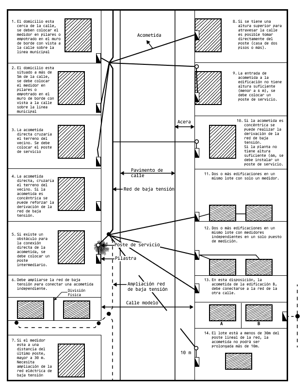
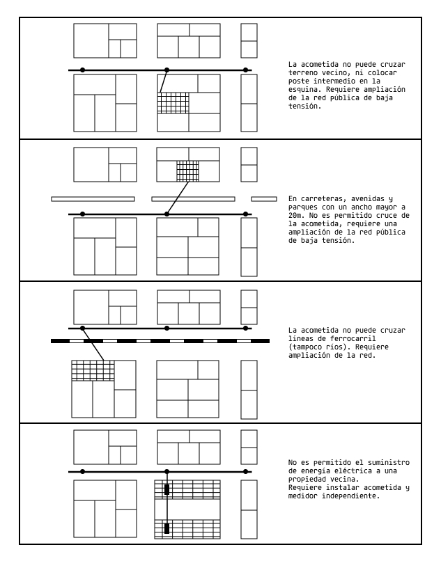

La distancia máxima permitida de una acometida debe de ser no mayor a 20 m, respetando las distancias de seguridad establecidas por cada empresa distribuidora. Mayor a esta distancia y hasta 40 m se instalará un poste de servicio o se ampliará la red de Baja Tensión.

En caso de utilizar acometidas soportadas en postes como estructuras intermedias, se debe cumplir con lo siguiente:

— el poste debe estar ubicado en la propiedad del consumidor.
—  encaso de poste de madera, el diámetro mínimo en la cima, no debe ser menor a 10 cm.
— la longitud mínima total del poste debe ser de 7 m cuando la red esté al frente y en casos especiales en la misma acera, por ejemplo: en garaje, en cola de línea u otros.

La distancia mínima de seguridad entre la acometida, ventanas, puertas y balcones, debe estar de acorde a la norma NB 148014

NOTA: Cuando la acometida sea de cable aislado y no cuente con acceso a ventanas, puertas y balcones esta puede tener una distancia mínima de cero (0).

En caso de acometidas subterráneas, la distancia minima debe ser de 10 cm de separación entre los conductores de la acometida subterráneos y el alcantarillado.

El la Figura 5 muestra las disposiciones físicas generales para acometidas. La Figura 6 muestra las condiciones no permitidas generales para acometidas.

Figura 5 - Disposiciones generales para la acometida

<!-- página 2 -->

Figura 6 — Condiciones no permitidas generales para la acometida

8.1.1 Alturas de acometida para edificios altos, viviendas y terrenos

Las alturas de llegada de los conductores aéreos de la acometida desde de la red de distribución a la edificación, estarán establecidas de acuerdo con las alturas de seguridad establecidas, cumpliendo las especificaciones técnicas solicitadas por las distribuidoras.
