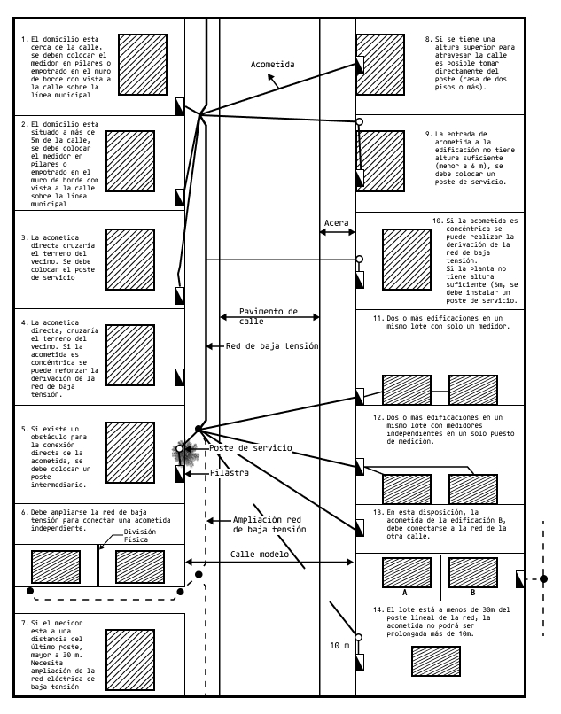
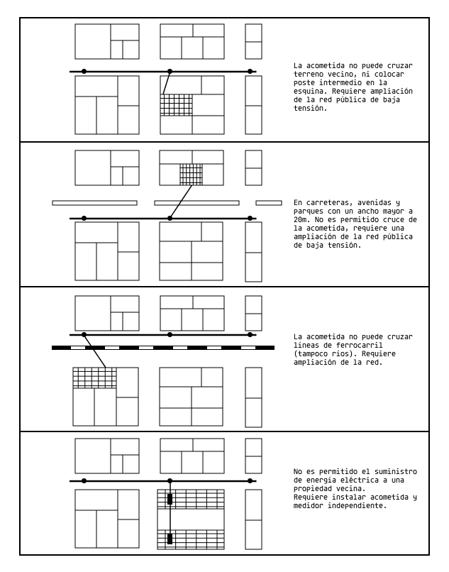
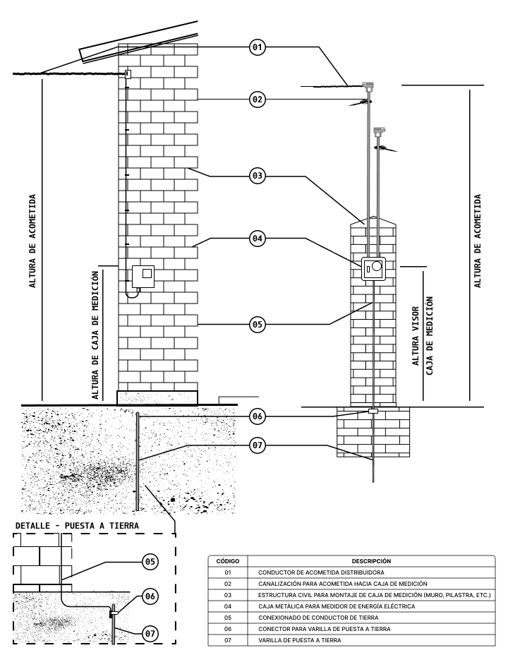

La distancia máxima permitida de una acometida debe de ser no mayor a 20 m, respetando las distancias de seguridad establecidas por cada empresa distribuidora. Mayor a esta distancia y hasta 40 m se instalará un poste de servicio o se ampliará la red de Baja Tensión.

En caso de utilizar acometidas soportadas en postes como estructuras intermedias, se debe cumplir con lo siguiente:

— el poste debe estar ubicado en la propiedad del consumidor.
—  encaso de poste de madera, el diámetro mínimo en la cima, no debe ser menor a 10 cm.
— la longitud mínima total del poste debe ser de 7 m cuando la red esté al frente y en casos especiales en la misma acera, por ejemplo: en garaje, en cola de línea u otros.

La distancia mínima de seguridad entre la acometida, ventanas, puertas y balcones, debe estar de acorde a la norma NB 148014

NOTA: Cuando la acometida sea de cable aislado y no cuente con acceso a ventanas, puertas y balcones esta puede tener una distancia mínima de cero (0).

En caso de acometidas subterráneas, la distancia minima debe ser de 10 cm de separación entre los conductores de la acometida subterráneos y el alcantarillado.

El la Figura 5 muestra las disposiciones físicas generales para acometidas. La Figura 6 muestra las condiciones no permitidas generales para acometidas.

Figura 5 - Disposiciones generales para la acometida

<!-- página 2 -->

Figura 6 — Condiciones no permitidas generales para la acometida

<!-- página 3 -->

8.1.1 Alturas de acometida para edificios altos, viviendas y terrenos

Las alturas de llegada de los conductores aéreos de la acometida desde de la red de distribución a la edificación, estarán establecidas de acuerdo con las alturas de seguridad establecidas, cumpliendo las especificaciones técnicas solicitadas por las distribuidoras.

En la figura 5 se establecen criterios generales de este tipo de acometidas.

Figura 7 - Alturas de acometida

<!-- página 4 -->

8.1.2 Distancias mínimas a servicios independientes de la instalación

Estas distancias son requerimientos particulares para evitar interferencias electromagnéticas, podrían ser mayores según las características del proyecto.

- distancia entre conductores de energía y conductores de señalización y comando, 0.2m

- distancia entre conductores de energía y conductores de telecomunicaciones y transmisión de datos, 0.2m

- distancia entre conductores de telecomunicaciones y conductores de señalización y comando, 0.2m

- distancia entre conductores de energía y canalizaciones de agua, 0.2m

- distancia entre conductores de energía con empalmes y juntas de canalización de agua, 1.0m:

— la distancia debe ser de 50 cm para redes primarias y 25 cm para redes secundarias entre las canalizaciones de conductores eléctricos y ductos de gas.

En el caso de no poder mantener la separación efectiva de estos conductores, se deben separar a través de una hilera de ladrillos u otros materiales dieléctricos, resistentes al fuego, al arco eléctrico y que sean malos conductores del calor, de por lo menos 0,05 m de espesor.

8.1.3 Instalaciones extraordinarias con más de una acometida

Únicamente se permiten acometidas adicionales, para los siguientes casos:

- edificaciones que, por razones técnicas, sean necesarias más de una acometida
- los exigidos legalmente por la autoridad competente

En el caso que se instale más de una acometida debe especificarse en todos los tableros la cantidad de acometidas existentes y el uso o área que alimenta cada una de ellas.

8.1.4 Pilastra o machón para acometidas

La pilastra debe de ser construida de acuerdo a diseño establecido por cada empresa distribuidora.

La pilastra es la construcción civil donde se dispone el bastón de ingreso y salida, la caja de medición, y se instala el medidor, el dispositivo de protección más otros accesorios.

La pilastra con el medidor para domicilios particulares debe de estar en la línea de propiedad del consumidor para que el lecturador no ingrese a la propiedad privada

La caja o gabinete de medición puede estar dentro de la propiedad privada, siempre y cuando sea de libre acceso, en edificios: privados y públicos, mercados y en lugares donde este autorizado por la empresa distribuidora

<!-- página 5 -->

8.1.5 Acometidas para múltiples usuarios

La acometida para múltiples usuarios, así como la caja o gabinete de medición debe ser construida de acuerdo con el diseño establecido por cada empresa distribuidora.

8.1.6 Sistema de distribución con blindobarras

Se podrán instalar sistemas con blindobarras en instalaciones internas para proyectos eléctricos particulares o de múltiples usuarios, en edificaciones verticales u horizontales, donde los tableros de medición pueden distribuirse a lo largo de la edificación, siempre y cuando se cumplan las siguientes condiciones:

- se deberán instalar sistemas de medición inteligente AMI para todos los proyectos con sistemas blindobarras con la finalidad de no dificultar los procesos de lecturación del consumo de electricidad, y las actividades de corte y reconexión.

— queda establecido que el mantenimiento del sistema interno de las blindobarras es de responsabilidad del usuario.

8.2 Alimentadores

Un alimentador (principal o secundario) es el conjunto de conductores que transportan energía eléctrica desde los tableros de medición hasta el tablero general y a los tableros de distribución de los circuitos derivados.

8.3 Selección de conductores

La determinación del calibre de un alimentador debe efectuarse en función a la tensión de la red de distribución y a los siguientes criterios:

- capacidad térmica de conducción y tipo de aislamiento
— maxima caída de tensión
- máxima corriente de cortocircuito

La sección nominal de los conductores debe seleccionarse en forma preliminar de acuerdo al primer criterio, tomando en cuenta todos los factores de corrección que sean pertinentes, debiendo verificarse la caída de tensión en los rangos establecidos. Para instalaciones con transformador propio debe considerarse la máxima corriente de cortocircuito de los circuitos.

La Tabla 11 muestra los calibres normalizados de los conductores, calibre en mm2 o mediante la galga americana AWG.

Todos los conductores utilizados para los alimentadores deben cumplir con lo especificado en el punto 8.4 de esta norma

8.3.1 Capacidad térmica de conducción

Los conductores deben tener una capacidad de conducción no menor a la máxima corriente a ser atendida.

En la selección del conductor por capacidad de conducción se deben considerar los siguientes factores:

<!-- página 6 -->

— tipo de aislante y temperatura máxima admitida por aislante
- tipo de instalación de los conductores y número de conductores agrupados

Tabla 11 - Calibres normalizados

| IEC, en mm2 | AWG (* MCM) Nro | AWG (* MCM) mm2 |
| ----------- | --------------- | --------------- |
|             | 40              | 0.0050          |
|             | 39              | 0.0062          |
| 0.0072      |                 |                 |
|             | 38              | 0.0082          |
|             | 37              | 0.0100          |
| 0.12        |                 |                 |
|             | 36              | 0.013           |
|             | 35              | 0.016           |
| 0.018       |                 |                 |
|             | 34              | 0.02            |
|             | 33              | 0.025           |
| 0.029       |                 |                 |
|             | 32              | 0.032           |
|             | 31              | 0.040           |
| 0.046       |                 |                 |
|             | 30              | 0.051           |
|             | 29              | 0.065           |
| 0.073       |                 |                 |
|             | 28              | 0.08            |
|             | 27              | 0.102           |
| 0.12        |                 |                 |
|             | 26              | 0.128           |
|             | 25              | 0.163           |
| 0.18        |                 |                 |
|             | 24              | 0.20            |
|             | 23              | 0.26            |
| 0.3         |                 |                 |
|             | 22              | 0.32            |
|             | 21              | 0.41            |
| 0.5         |                 |                 |
|             | 20              | 0.52            |
|             | 19              | 0.65            |
| 0.75        |                 |                 |
|             | 18              | 0.82            |
| 1           |                 |                 |
|             | 17              | 1.04            |
|             | 16              | 1.31            |
| 1.5         |                 |                 |
|             | 15              | 1.65            |
|             | 14              | 2.08            |
| 2.5         |                 |                 |
|             | 13              | 2.63            |
|             | 12              | 3.31            |
| 4           |                 |                 |
|             | 11              | 4.15            |
|             | 10              | 5.26            |
| 6           |                 |                 |
|             | 9               | 6.65            |
|             | 8               | 8.36            |
| 10          |                 |                 |
|             | 7               | 10.52           |
|             | 6               | 13.28           |
| 16          |                 |                 |
|             | 5               | 16.7            |
|             | 4               | 21.15           |
| 25          |                 |                 |
|             | 3               | 27              |
|             | 2               | 33.62           |
| 35          |                 |                 |
|             | 1               | 42.37           |
| 50          |                 |                 |
|             | 1/0             | 53.49           |
|             | 2/0             | 67.43           |
| 70          |                 |                 |
|             | 3/0             | 85.01           |
| 95          |                 |                 |
|             | 4/0             | 107.21          |
| 120         |                 |                 |
|             | 250 (*)         | 126.69          |
| 150         |                 |                 |
|             | 300 (*)         | 151.86          |
|             | 350 (*)         | 177.43          |
| 185         |                 |                 |
|             | 400 (*)         | 202.69          |
| 240         |                 |                 |
|             | 500 (*)         | 253.06          |
| 300         |                 |                 |
|             | 600 (*)         | 304.24          |
|             | 700 (*)         | 354.45          |
|             | 750 (*)         | 380.00          |
| 400         |                 |                 |
|             | 800 (*)         | 405.71          |
|             | 900 (*)         | 455.00          |
| 500         |                 |                 |
|             | 1000 (*)        | 506.04          |
| 630         |                 |                 |
|             | 1250 (*)        | 633.40          |
|             | 1500 (*)        | 760.10          |
| 800         |                 |                 |
|             | 1750 (*)        | 888.70          |
| 1000        |                 |                 |
|             | 2000 (*)        | 1013.00         |
|             | 2500 (*)        | 1266.20         |

<!-- página 7 -->

No se deben utilizar conductores empalmados o cuyo aislamiento este dañado.

8.3.2 Maxima corriente de cortocircuito en conductores

La máxima corriente de cortocircuito que soporta un conductor se debe calcular con la siguiente expresión:

$$
I_{cc} = \frac{0{,}34A}{\sqrt{t}} \left[ \log \left( \frac{234 + T_f}{234 + T_i} \right) \right]^{\frac{1}{2}}
$$

Donde:
*A* sección del conductor, en mm2.
*t* tiempo de duración de la falla, en s.
*T_f* temperatura máxima admisible del conductor en régimen de cortocircuito, en °C.
*T_i* temperatura máxima admisible del conductor en régimen normal de operación, en °C.
*ICC* máxima corriente de cortocircuito, en kA.

Como referencia, la Tabla 13 muestra valores normalizados para T_f y T_i, para un determinado tipo de conductos.

Tabla 13 - Valores normalizados de Try Ti

| Tipo de aislación             | T_f, en°C | T_i en°C |
| ----------------------------- | --------- | -------- |
| PVC                           | 160       | 70       |
| Polietileno reticulado (XLPE) | 250       | 90       |
| Goma etileno propileno        | 250       | 90       |

8.3.3 Caida de tensión

La máxima caida de tensión permitida en un alimentador principal debe ser del 2 %, este valor será calculado considerando las cargas que funcionen simultáneamente. El valor límite de la caida de tensión en cada uno de los circuitos podrá compensarse entre el alimentador y los circuitos derivados de las cargas y no sobrepasar los valores determinados.

8.4 Características de los conductores

El tipo de conductor a utilizarse, preferentemente será el designado como conductor enhebrado en sus diferentes tipos (formado por varios alambres iguales de sección menor, comúnmente llamado cable). El uso de conductor designado como alambre (sección circular sólida única), será de uso alternativo para secciones de 1,5 mm2; 2,5 mm2; 4,0 mm2 y 6,0 mm2 (calibre AWG No. 16, 14, 12 y 10). (véase NB/NM 60228-1)

Los conductores y su designación correspondiente, se identificará con los siguientes colores (véase Tabla 14).

<!-- página 8 -->

Tabla 14 - Codigo de colores para conductores

| Conductor     | Designación     | Color                     |
| ------------- | --------------- | ------------------------- |
| Fase 1        | (R); (A); (L1)  | Azul                      |
| Fase 2        | (S); (B); (L2)  | Negro                     |
| Fase 3        | (T); (C); (L3)) | Rojo                      |
| Neutro        | (N)             | Blanco o celeste          |
| De protección | (PE)            | Verde y amarillo; o verde |

En caso de no existir en el mercado conductores de color negro, rojo y azul, se deben utilizar Colores distintos al blanco, celeste, verde, amarillo y verde-amarillo y deben identificarse univocamente cada conductor en los dos (2) extremos de cada tramo, mediante cintas con colores normalizados, o sus denominaciones, anillos u otro método de identificación indeleble y estable en el tiempo.

Para el conductor de fase de una distribución monofásica, se podrá utilizar indistintamente cualquiera de los conductores indicados para las fases.

Si una alimentación monofásica parte de una trifásica dentro de una misma instalación, el color del conductor de fase de dicha alimentación monofásica debe ser coincidente con el de la fase que le dio origen.

Para funciones distintas a las indicadas anteriormente, por ejemplo, retornos de los circuitos de comando de iluminación, no se pueden usar los colores destinados a las fases, neutro o protección.

La Tabla 15 muestra la intensidad de corriente admisible de referencia para conductores de cobre aistados con PVC.

Para efectos de aplicación de la Tabla 15, los tipos de instalación 1 a 7 de la Tabla 12, son considerados en ducto y los tipos 8 a 13 son considerados al aire libre.

La Tabla 16 muestra los factores de corrección por temperatura ambiente diferente a 30 °C, a ser aplicados a las capacidades de conducción de la Tabla 15.

La Tabla 17 muestra los factores de corrección que se deben aplicar a los valores de la tabla 15, cuando hubiera agrupamientos de más de tres (3) conductores sin espaciamiento, o más de tres (3) conductores instalados en un cable multipolar.

Cuando por distintas razones sean utilizados conductores de características de aislación especiales, la capacidad de conducción y factores de corrección deben ser determinados de acuerdo a las normas del fabricante de los conductores.

<!-- página 9 -->

Tabla 15 - Intensidad de corriente admisible para conductores de cobre aislados con PVC, para una temperatura de operación de 70 °C a temperatura ambiente de 30 °C (hasta tres (3) conductores agrupados)

| Sección nominal, en cm2 | Grupo 1 | Grupo 2 | Grupo 3 |
| ----------------------- | ------- | ------- | ------- |
| 0.75                    | -       | 12      | 15      |
| 1                       | 11      | 15      | 19      |
| 1.5                     | 15      | 19      | 23      |
| 2.5                     | 20      | 25      | 32      |
| 4                       | 25      | 34      | 42      |
| 6                       | 33      | 44      | 54      |
| 10                      | 45      | 61      | 73      |
| 16                      | 61      | 82      | 98      |
| 25                      | 83      | 108     | 129     |
| 35                      | 103     | 134     | 158     |
| 50                      | 132     | 167     | 197     |
| 70                      | 164     | 207     | 244     |
| 95                      | 197     | 249     | 291     |
| 120                     | 235     | 291     | 343     |
| 150                     | -       | 327     | 382     |
| 185                     | -       | 374     | 436     |
| 240                     | -       | 442     | 516     |
| 300                     | -       | 510     | 595     |
| 400                     | -       | -       | 708     |
| 500                     | -       | -       | 809     |

GRUPO 1: Monoconductores tendidos al interior de ductos.
GRUPO 2: Multiconductores con cubierta común, que van al interior de tubos metálicos, cables planos, cables portátiles o móviles, etc.
GRUPO 8: Monocenductores tendidos sobre aisladores.

Tabla 16 - Factores de corrección para temperatura ambiente diferente a 30 °C y 20°C para líneas subterráneas (temperatura del suelo)

| Temperatura, en °C | PVC      | EPR o XLPE | PVC   | EPR o XLPE |
| ------------------ | -------- | ---------- | ----- | ---------- |
| Temperatura, en °C | Ambiente | Ambiente   | Suelo | Suelo      |
| 10                 | 1.22     | 1.15       | 1.10  | 1.07       |
| 15                 | 1.17     | 1.12       | 1.05  | 1.04       |
| 20                 | 1.12     | 1.08       | 1     | 1          |
| 25                 | 1.06     | 1.04       | 0.95  | 0.96       |
| 30                 | 1        | 1          | 0.89  | 0.93       |
| 35                 | 0.94     | 0.96       | 0.84  | 0.89       |
| 40                 | 0.87     | 0.91       | 0.77  | 0.85       |
| 45                 | 0.79     | 0.87       | 0.71  | 0.80       |
| 50                 | 0.71     | 0.82       | 0.63  | 0.76       |
| 55                 | 0.61     | 0.76       | 0.55  | 0.71       |
| 60                 | 0.50     | 0.71       | 0.45  | 0.65       |
| 65                 | -        | 0.65       | -     | 0.60       |
| 70                 | -        | 0.58       | -     | 0.53       |
| 75                 | -        | 0.50       | -     | 0.46       |
| 80                 | -        | 0.41       | -     | 0.38       |

<!-- página 10 -->

Tabla 17 - Conductores de cobre aislados con PVC para una temperatura de operación de 70 °C, a temperatura ambiente de 30 °C (hasta tres (3) conductores agrupados)

| Calibre AWG (* MCM) | Sección, en mm2 | Capacidad de corriente, en A | Capacidad de corriente, en A |
| ------------------- | --------------- | ---------------------------- | ---------------------------- |
| Calibre AWG (* MCM) | Sección, en mm2 | En ducto                     | Aire libre                   |
| 16                  | 1.31            | 10                           | 15                           |
| 14                  | 2.08            | 15                           | 20                           |
| 12                  | 3.31            | 20                           | 25                           |
| 10                  | 5.26            | 30                           | 40                           |
| 8                   | 8.36            | 40                           | 60                           |
| 6                   | 13.28           | 55                           | 80                           |
| 4                   | 21.15           | 70                           | 105                          |
| 2                   | 33.62           | 95                           | 140                          |
| 1                   | 42.37           | 110                          | 160                          |
| 1/0                 | 53.9            | 150                          | 195                          |
| 2/0                 | 67.43           | 175                          | 225                          |
| 3/0                 | 85.01           | 200                          | 255                          |
| 4/0                 | 107.21          | 230                          | 305                          |
| 250 (*)             | 126.69          | 255                          | 335                          |
| 300 (*)             | 151.86          | 285                          | 375                          |
| 350 (*)             | 177.43          | 310                          | 405                          |
| 400 (*)             | 202.69          | 335                          | 435                          |
| 500 (*)             | 253.06          | 380                          | 500                          |
| 600 (*)             | 304.24          | 420                          | 555                          |
| 700 (*)             | 354.45          | 460                          | 600                          |
| 800 (*)             | 405.71          | 490                          | 645                          |
| 900 (*)             | 457.44          | 520                          | 680                          |
| 1000 (*)            | 506.04          | 545                          | 710                          |

Tabla 18 - Intensidad de corriente admisible para conductores de cobre (secciones AWG), temperatura ambiente 30 °C (aislados temperatura de servicio: 60 °C, 75 °C 90°C)

| Sección AWG | Grupo A                 | Grupo A                 | Grupo A                 | Grupo B                 | Grupo B                 | Grupo B                 |
| ----------- | ----------------------- | ----------------------- | ----------------------- | ----------------------- | ----------------------- | ----------------------- |
| Sección AWG | Temperatura de servicio | Temperatura de servicio | Temperatura de servicio | Temperatura de servicio | Temperatura de servicio | Temperatura de servicio |
| Sección AWG | 60 °C                   | 75 °C                   | 90 °C                   | 60 °C                   | 75 °C                   | 90 °C                   |
| 22          | 3                       | 3                       | -                       | -                       | -                       | -                       |
| 20          | 5                       | 5                       | -                       | -                       | -                       | -                       |
| 18          | 7.5                     | 7.5                     | -                       | -                       | -                       | -                       |
| 16          | 10                      | 10                      | -                       | -                       | -                       | -                       |
| 14          | 15                      | 15                      | 25                      | 20                      | 20                      | 30                      |
| 12          | 20                      | 20                      | 30                      | 25                      | 25                      | 40                      |
| 10          | 30                      | 30                      | 40                      | 40                      | 40                      | 55                      |
| 8           | 40                      | 45                      | 50                      | 55                      | 65                      | 70                      |
| 6           | 55                      | 65                      | 70                      | 80                      | 95                      | 100                     |
| 4           | 70                      | 85                      | 90                      | 105                     | 125                     | 135                     |
| 3           | 80                      | 10                      | 10                      | 120                     | 145                     | 155                     |
| 2           | 95                      | 11                      | 12                      | 140                     | 180                     |                         |
| 1           | 11                      | 13                      | 14                      | 165                     | 210                     |                         |
| 1/0         | 12                      | 15                      | 15                      | 195                     | 245                     |                         |
| 2/0         | 14                      | 17                      | 18                      | 225                     | 285                     |                         |
| 3/0         | 16                      | 20                      | 21                      | 260                     | 330                     |                         |
| 4/0         | 19                      | 23                      | 23                      | 300                     | 385                     |                         |
| 2           | 21                      | 25                      | 27                      | 340                     | 425                     |                         |
| 3           | 24                      | 28                      | 30                      | 375                     | 480                     |                         |
| 3           | 26                      | 31                      | 32                      | 420                     | 530                     |                         |
| 4           | 28                      | 35                      | 36                      | 455                     | 575                     |                         |
| 5           | 32                      | 38                      | 40                      | 515                     | 660                     |                         |
| 6           | 35                      | 42                      | 45                      | 475                     | 740                     |                         |
| 7           | 38                      | 46                      | -                       | 630                     | -                       |                         |
| 7           | 40                      | 47                      | 50                      | 655                     | 845                     |                         |
| 8           | 41                      | 49                      | -                       | 680                     | -                       |                         |
| 9           | 43                      | 52                      | -                       | 730                     | -                       |                         |
| 1           | 45                      | 54                      | 58                      | 780                     | 1                       |                         |
| 1           | 49                      | 59                      | -                       | 890                     | -                       |                         |
| 1           | 52                      | 62                      | -                       | 980                     | -                       |                         |
| 1           | 54                      | 65                      | -                       | 1070                    | -                       |                         |
| 2           | 56                      | 66                      | -                       | 1155                    | -                       |                         |

<!-- página 11 -->

Tabla 19 - Factores de corrección para temperatura ambiente diferente a 30 °C, Calibre AWG

| Temperatura ambiente °C | Temperatura de servicio | Temperatura de servicio |
| ----------------------- | ----------------------- | ----------------------- |
| Temperatura ambiente °C | 60 °C                   | 75 °C                   |
| Más de 30 hasta 40      | 0.82                    | 0.88                    |
| Más de 40 hasta 45      | 0.71                    | 0.82                    |
| Más de 45 hasta 50      | 0.58                    | 0.75                    |
| Más de 50 hasta 55      | 0.41                    | 0.67                    |
| Más de 55 hasta 60      | -                       | 0.58                    |
| Más de 60 hasta 70      | -                       | 0.35                    |

8.5 Factores de corrección por agrupamiento

Los factores se aplican a los grupos de conductores del mismo tipo de aislamiento y de la misma temperatura máxima de funcionamiento.

Para grupos que contienen conductores cuyo aislamiento presentan diferentes temperaturas máximas de funcionamiento, la intensidad admisible de todos los conductores aislados del grupo debe basarse sobre la temperatura máxima de funcionamiento más baja de cualquier conductor del grupo con el factor de corrección de agrupamiento apropiado.

<!-- página 12 -->

Si en un grupo de conductores hubiese algunos cuya corriente que transporte no supera el 30% de la corriente asignada a su grupo, este conductor puede ser ignorado para el propósito de utilizar el factor de reducción por agrupamiento.

Tabla 20 - Factores de corrección a aplicar cuando hubieren más de tres (3) conductores agrupados o más de tres (3) conductores en un cable multipolar

| Número de conductores instalados | Factores de corrección |
| -------------------------------- | ---------------------- |
| 4 a 6                            | 0.8                    |
| 7 a 9                            | 0.70                   |
| 10 a 20                          | 0.50                   |
| 21 a 30                          | 0.45                   |
| 31 a 40                          | 0.40                   |
| Más de 41                        | 0.35                   |

8.6 Conductor neutro

Para dimensionar el conductor neutro se deben tomar en cuenta los siguientes criterios:

- para los circuitos monofásicos debe ser de la misma sección del conductor de fase.

- el conductor neutro debe conectarse al sistema de tierra de acuerdo a los esquemas descritos en el apartado 3 de la norma NB 777-2.

- en los circuitos trifásicos, para dimensionar el conductor neutro se debe considerar el maximo desequilibrio que pueda preverse, las corrientes armónicas y los factores de reducción indicados en la tabla 20, no siendo inferior a los siguientes valores (véase Tabla 21).

Tabla 21- Selección del calibre del conductor neutro

| Sección del conductor de fase, en mm2 | Sección mínima del conductor neutro, en mm2 |
| ------------------------------------- | ------------------------------------------- |
| 10                                    | 10                                          |
| 16                                    | 10                                          |
| 25                                    | 16                                          |
| 35                                    | 16                                          |
| 50                                    | 25                                          |
| 70                                    | 35                                          |
| 95                                    | 50                                          |
| 120                                   | 70                                          |
| 150                                   | 70                                          |
| 185                                   | 95                                          |
| 240                                   | 120                                         |

Si el valor de la composición de armónicos supera el 10% (THD - Total Harmonic Distortion / Distorsión Armónica Total), el conductor neutro no debe tener un calibre menor al calibre de los conductores de fase. Los efectos térmicos debido a las corrientes armónicas y los factores de reducción se describen en la Tabla 22.

<!-- página 13 -->

Tabla 22 - Factores de corrección aplicable a circuitos trifásicos de cuatro (4) o cinco (5) conductores donde está prevista la presencia de armónicos de 3° orden

| Porcentaje de la 3° armónica en la corriente de fase, en % | Factor de corrección                      | Factor de corrección                       |
| ---------------------------------------------------------- | ----------------------------------------- | ------------------------------------------ |
| Porcentaje de la 3° armónica en la corriente de fase, en % | Selección basada en la corriente de línea | Selección basada en la corriente de neutro |
| 0 - 15                                                     | 1.00                                      | -                                          |
| 15 - 33                                                    | 0.86                                      | -                                          |
| 33 - 45                                                    | -                                         | 0.86                                       |
| > 45                                                       | -                                         | 1.00                                       |

Estos valores de reducción son aplicables a sistemas trifásicos equilibrados y a cables de 4 o 5 conductores donde el conductor neutro sea del mismo material y de la misma sección de los conductores de fase. Estos valores de reducción de las intensidades admisibles fueron calculados sobre la base de las corrientes de tercera armónica; no obstante, si fueran esperadas distorsiones mayores al 10% por las corrientes armónicas superiores, son aplicables también las reducciones consideradas.

Los factores reducción de la Tabla 22 se utilizan en sistemas compuestos por cuatro (4) o cinco (5) conductores cuyo conductor neutro será del mismo material y sección del conductor de fase

Si la corriente del conductor neutro es superior al 135 % al de la fase y la selección del conductor se realiza en función de la corriente del neutro, entonces los conductores de fase no estarán totalmente cargados, en este caso la reducción del calor generado por los conductores de fase compensa el calor generado por el conductor neutro y no aplica el factor de reducción por agrupamiento a la corriente admisible para los tres conductores cargados.

8.7 Fijación de los conductores

Los conductores se deben adosar o fijar de manera segura, con elementos aislados que eviten dañar el aislamiento del conductor, en las paredes o estructuras; quedando prohibido fijarlos a escaleras de incendio, instalaciones de plomería o canales de drenaje u otras, que podrían eventualmente quedar energizadas.
